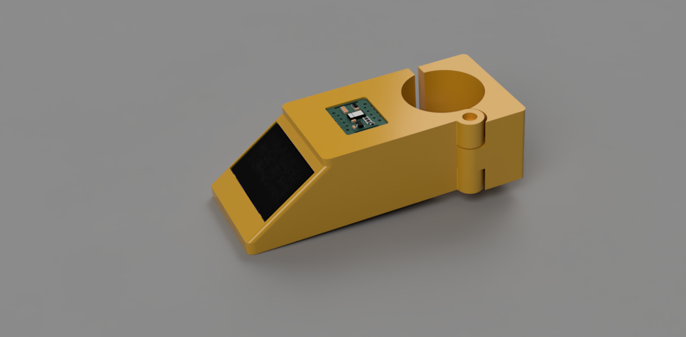
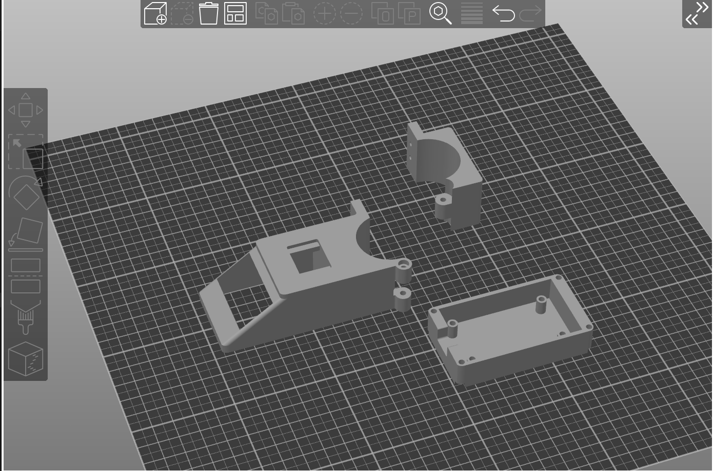
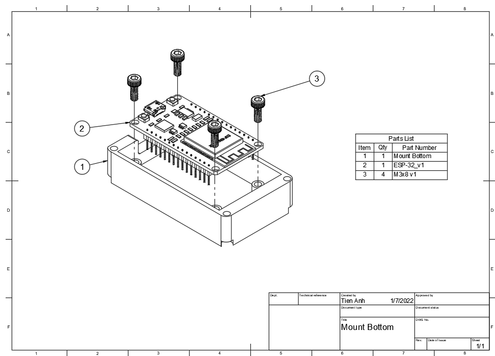
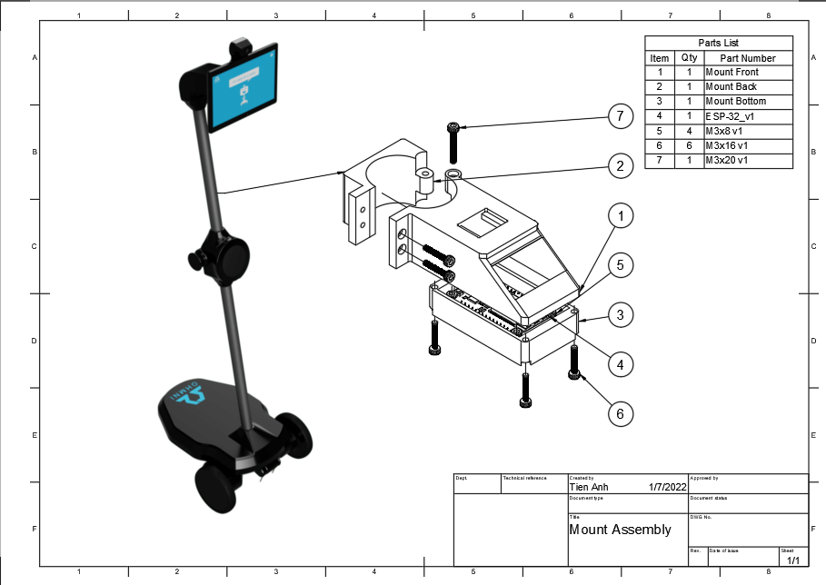

Ohmni Health Mount
==============================

A mount to attach an Max30102 sensor to Ohmni Robot.

## 1. CAD Files
 - You will need  [Fusion360](https://www.autodesk.com/products/fusion-360/overview)  to open CAD file.
 - There is no requirement to open STEP file but it might take long time to load.

## 2. Print settings

<pre>Layer height : 0.2mm
Wall count : 5
Top/bottom layer : 5
Infill : 30% Gyroid 
Outer wall line width : 0.4mm
Inner wall line width : 0.45mm
Infill line width : 0.5mm
Filament: ABS+
</pre>

## 3. BOM
### 3.1 3D printed
| Item                     | Quantity |                     
| ------------------------ | -------- | 
| **Mount Front**          | 1        | 
| **Mount Back**           | 1        | 
| **Mount Bottom**         | 1        | 
### 3.1 Fasteners
| Item                     | Quantity |                     
| ------------------------ | -------- | 
| M3x8  SHCS               | 1        | 
| M3x16 SHCS               | 1        | 
| M3x20 SHCS               | 1        |\

## 4. Parts orientaton 
\

## 5. Assembly Instructions 
\

\

## 6. Showcase