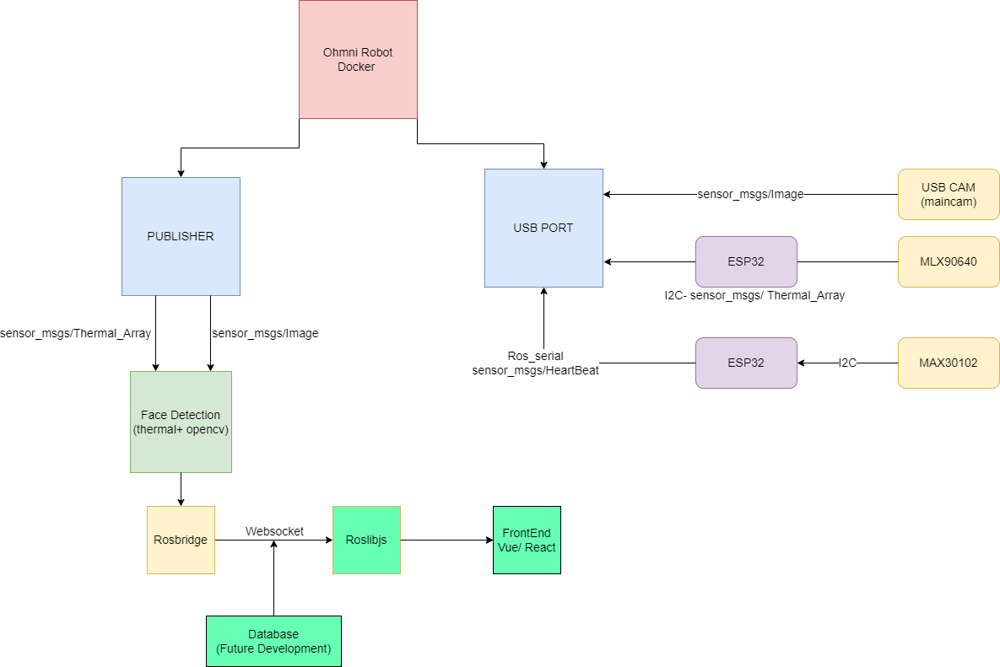

# OhmniRobot-contest-project
This is a project based on the technology of OhmniRobot, whose information can be found at [OhmniLabs website](https://ohmnilabs.com/)

Objective: To provide a local-hosted webpage, accessible by OhmniRobot via its available tools, displaying health information (temperature and SpO2 ratio) of participants.

In this file will you find prerequisite on hardwares, middlewares and softwares installation along with their purposes; instructions on how to use source code files and what outputs to expect from them.

Let's begin!

## Features
| Feature                                           | Inspiration by/Description         |
| ------------------------------------------------- | ---------------------------------- |
| Capture facial region temperature                 | Developed                          |
| Retrieve SpO2 ratio                               | Developed                          |
| 3D-printed mount                                  | Designed for OhmniRobot            |
| Web server                                        | Vue framework, designed            |
| Display health data on web server                 | In progress                        |
| Docker                                            | Inspired by OhmniRobot Docker      |

## 1. Requirements

[>>> Click here <<<](./doc/requirements.md)

## 2. Instructions

[a/ Firmware](./firmware/README.md)

[b/ 3D printed](./3D_parts/README.md)

[c/ Building Docker Image](./docker/README.md)

[d/ Running ros nodes](./doc/node-run.md)

## 3. Versions

[>>> Click here <<<](./doc/updates.md)

## 4. Running examples
[>>> Proof of concept <<<](https://drive.google.com/drive/folders/1nofOxXsUI-n6_u-spGsJwN6mi2wBW4wH)

