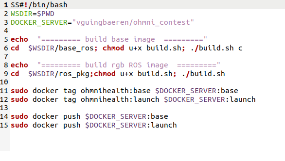
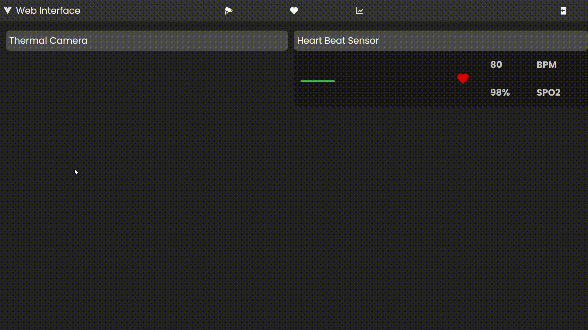

# Docker Build 
This repository contains build files for building ROS docker images for reading and processing sensor data.
It's inspired by [OhmniLabs](https://gitlab.com/ohmni-sdk/docker-ohmni-rgbcamera)


Dependencies:
* libuvc backend: http://wiki.ros.org/libuvc_camera  
* v4l2 backend (standalone): http://wiki.ros.org/usb_cam 
* v4l2 backend (gstreamer): http://wiki.ros.org/gscam 
* Web_video_server: http://wiki.ros.org/web_video_server
* Ros bridge: http://wiki.ros.org/rosbridge_suite
* Ros serial: http://wiki.ros.org/rosserial

# Build Images
Requirements:
 * Host enviroment: Ubuntu 20.04, amd64
 * Docker [Install instruction](https://docs.docker.com/install/linux/docker-ce/ubuntu/)

To build these images, change the _DOCKER_SERVER_ variable in the _build_all.sh_ file to your publish registry and run:
```
chmod u+x build_all.sh
./build_all.sh
```



This will build 2 images:
* $DOCKER_SERVER:base_ros: install all necessary dependencies (ROS, OpenCV, )
* $DOCKER_SERVER:launch_ros: add launch files and deploy scripts

Prebuilt image has been built in the [this repo](https://hub.docker.com/repository/docker/vguingbaeren/ohmni_contest), you could push and try it on Ohmni Robot.

# Basic Usage
**Step 1:** Pull the image onto the bot (Ohmni developer edition)

Build your images or try our prebuild images [Ohmni_Contest](docker pull vguingbaeren/ohmni_contest:launch), then adb or ssh to the bot, pull the image:
```
host computer$  adb connect [bot ip] && adb shell
bot cli: /$ su
bot cli: /# docker pull vguingbaeren/ohmni_health:launch
```
**Step 2:** run the image and access the main tmux session (make sure you don't open the camera by any app)
```
bot cli: /$ su
bot cli: /# docker run -it --privileged --network host -v /dev:/dev  vguingbaeren/ohmni_contest:launch 
```
Please open tmux "work" session for accessing all ros nodes and roscore.
```
docker cli: /# tmux attach -t work
```
By default for this image, we open the main camera: 640x480@30Hz uyuv format and roscore


Go to your workspace, if you had already created one, or follow [ROS Tutorial](http://wiki.ros.org/ROS/Tutorials) and create yourself a **ros_ws**.

Git clone the repository:
```
cd ~/ros_ws/src
git clone https://github.com/VGUIngenieurBaeren/OhmniRobot-contest-project.git
```

Then go back to your workspace and compile it:
```
cd ~/ros_ws
catkin_make
```
### For hosting local Vue server

#### Project setup
```
cd ~/ros_ws/src/Vue
npm install
npm install echarts
```

#### Compiles and hot-reloads for development
```
npm run serve
```


#### Expecting :



#### Compiles and minifies for production

```
npm run build
```

#### Lints and fixes files
```
npm run lint
```

#### Customize configuration
See [Configuration Reference](https://cli.vuejs.org/config/)

### For launching Heart beat node to display SpO2 data collected

#### Running Rosserial and Rosbridge
```
roslaunch heartbeat_ros ohmni_heartbeat.launch
```

#### Expecting :


### For launching face detection and thermal data collecting node:
```
rosrun thermalcam_ros face_temperature_publisher.py
```

#### Expecting results:


# Limitations
1. The Ohmni Health Docker 
1. Because 2 cameras of the bot are connected to a usb hub 2.0, the OS limits the bandwidth so you can't not get 2 streams at hight resolutions. Some combinations we tested will work (for v4l2) such as:
* 2 streams 320x240@30Hz yuyv
* 1 stream 1280x1024@30Hz mjpg + 1 stream 320x240@30Hz yuyv
* only one stream 640x48030Hz yuyv eachtime
We love to hear from you how improve this limitation

2. The mjpg decoder in avaibable packages is not efficient, need to improve this.
3. Open 2 streams using libuvc still does not work, because 2 cameras have same product id,vendor id, serial.  
4. While using this way to open a camera, our call app can not access to the camera stream. please refer [Docker examples - processing camera frames](https://docs.ohmnilabs.com/ohmnidocker/) to access the stream durring the call.
