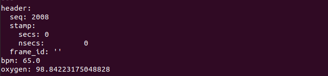
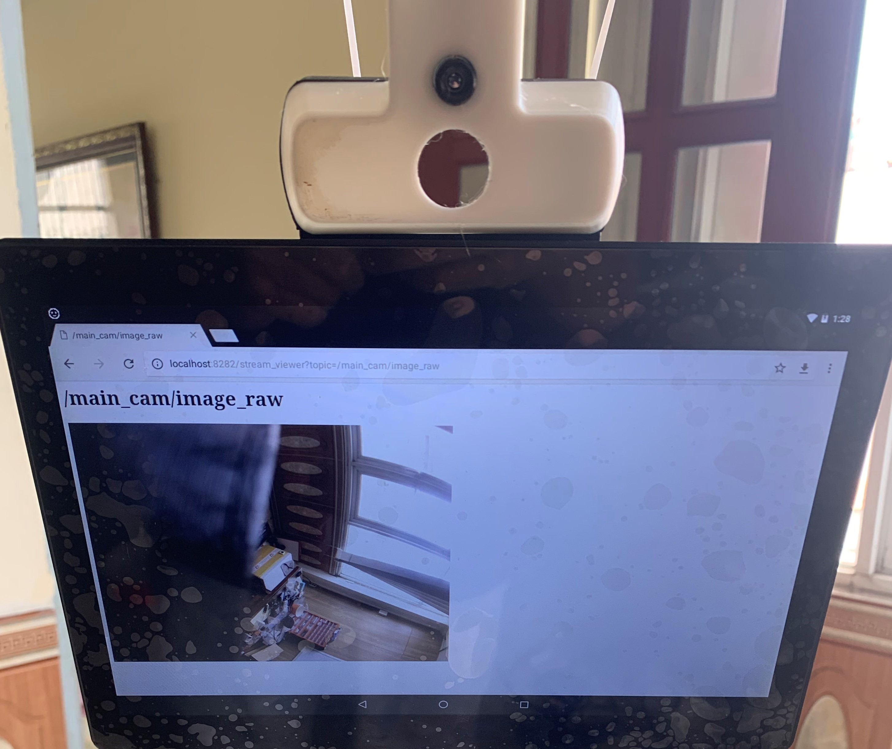
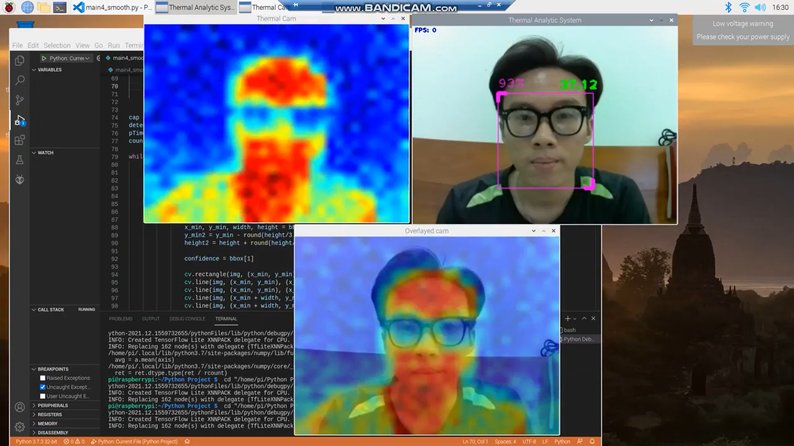

# Docker Build 
This repository contains build files for building ROS docker images for reading and processing sensor data.
It's inspired by [OhmniLabs](https://gitlab.com/ohmni-sdk/docker-ohmni-rgbcamera)


Dependencies:
* libuvc backend: http://wiki.ros.org/libuvc_camera  
* v4l2 backend (standalone): http://wiki.ros.org/usb_cam 
* v4l2 backend (gstreamer): http://wiki.ros.org/gscam 
* Web_video_server: http://wiki.ros.org/web_video_server
* Ros bridge: http://wiki.ros.org/rosbridge_suite
* Ros serial: http://wiki.ros.org/rosserial

# Build Images
Requirements:
 * Host enviroment: Ubuntu 20.04, amd64
 * Docker [Install instruction](https://docs.docker.com/install/linux/docker-ce/ubuntu/)

To build these images, change the _DOCKER_SERVER_ variable in the _build_all.sh_ file to your publish registry and run:
```
chmod u+x build_all.sh
./build_all.sh
```


This will build 2 images:
* $DOCKER_SERVER:base_ros: install all necessary dependencies (ROS, OpenCV, )
* $DOCKER_SERVER:launch_ros: add launch files and deploy scripts

Prebuilt image has been built in the [this repo](https://hub.docker.com/repository/docker/vguingbaeren/ohmni_contest), you could push and try it on Ohmni Robot.


# Basic Usage
**Step 1:** Pull the image onto the bot (Ohmni developer edition)

Build your images or try our prebuild images [Ohmni_Contest](docker pull vguingbaeren/ohmni_contest:launch), then adb or ssh to the bot, pull the image:
```
host computer$  adb connect [bot ip] && adb shell
bot cli: /$ su
bot cli: /# docker pull vguingbaeren/ohmni_health:launch
```
**Step 2:** run the image and access the main tmux session (make sure you don't open the camera by any app)

```
bot cli: /$ su
bot cli: /# docker run -it --privileged --network host -v /dev:/dev  vguingbaeren/ohmni_contest:launch 
```
Please open tmux "work" session for accessing all ros nodes and roscore.
```
docker cli: /# tmux attach -t work
```

By default for this image, we open the main camera: 640x480@30Hz uyuv format and roscore


### For hosting local Vue server

#### Compiles and minifies for production

```
npm run build
```
#### Expecting :


#### Customize configuration
See [Configuration Reference](https://cli.vuejs.org/config/)

### For launching Heart beat node to display SpO2 data collected

#### Running Rosserial and Rosbridge
```
roslaunch heartbeat_ros ohmni_heartbeat.launch
```

#### Expecting :


#### Running Web Video Server
```
rosrun web_video_server web_video_server _port:=8181
```
#### Expecting :




### For launching face detection and thermal data collecting node:
```
rosrun thermalcam_ros face_temperature_publisher.py
```

#### Expecting results:




# Limitations
1. The Ohmni Health Docker 

1) ROM
2) Camera bandwidth
3) 

