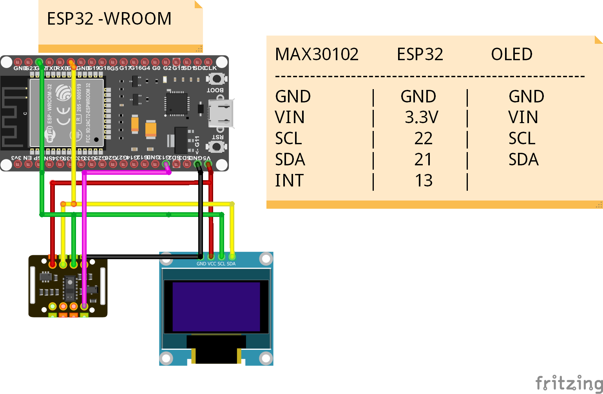

# Ohmni_Health Firmware

This is firmware for communicating between OhmniHealth module (ESP32) and Ohmni Robot via Rosserial.
## Configurations

 
 ### a) Ohmni Health
```
   MAX30102         ESP32
------------------------------------
     Vin             3.3V
     GND             GND
     SDA             21
     SCL             22
     INT             4
```

### b) Thermal Cam   
```
   MLX90640         RaspPi
------------------------------------
     Vin             3.3V
     GND             GND
     SDA             21
     SCL             22
```


## Building firmware

To build Ohmni_Health firmware you'll need  [PlatformIO](http://docs.platformio.org/en/latest/ide.html#platformio-ide). Detailed build and install instructions are posted at:

  - [Installing Platformio (VSCode)](https://platformio.org/install/ide?install=vscode)
      - [Thermal Cam](./thermal_cam): Reading MLX90640 and publishing to Ohmni Robot via Ros serial
      - [Ohmni Health](./ohmni_health): Processing IR data then calculate HeartBeat and SpO2.

### Clean the project
```
pio run --target clean
```


### Build and upload the project
```
pio run --target upload
```